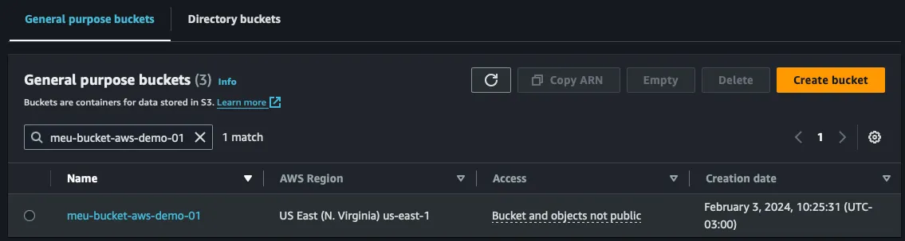

Um dos desafios que as equipes de tecnologia que possuem recursos na nuvem enfrentam, é que se caso os recursos não foram criados inicialmente se baseando em infraestrutura como código (ou seja, IaC, utilizando ferramentas como o Terraform), além de perder os diversos benefícios, como por exemplo, o reuso em outros projetos, podem enfrentar dores de cabeça ao introduzir essa nova forma de metodologia nos seus ciclos de desenvolvimento, onde é aproximado a infraestrutura como código junto aos repositório das aplicações e seus pipelines.

O problema comum é a equipe já ter infraestrutura rodando em produção, como agora trazer esses recursos para o ciclo de vida de um pipeline de infraestrutura como código, controlado pelo arquivo `.tfstate`, e como evitar possíveis impactos que isso pode trazer. Por exemplo, supondo que se tem um bucket S3 em ambiente produtivo na nuvem da AWS, uma das alternativas durante a migração para infraestrutura como código é criar um novo bucket e depois transitar na aplicação, mas essa estratégia pode trazer algumas dores de cabeça, além de ser uma estratégia custosa olhando as tarefas a serem realizas, então como podemos avisar o Terraform que os recursos já existem pensando em evitar downtime e retrabalho?

### Exemplificando o Problema
Vamos considerar a criação do bucket utilizando Terraform:

<script src="https://gist.github.com/davidalecrim1/8c4195b4443e64dd7891d074fdd26b19.js"></script>

Porém lembre-se do problema, é se a aplicação utilizando a infraestrutura já é produtiva, o que podemos fazer? Como podemos ver abaixo, o bucket já existe na conta AWS em uso.



Agora, vamos executar `terraform plan`, e ver o que acontece.

<script src="https://gist.github.com/davidalecrim1/32ae64e95396707a93e2ecd4eefe1baf.js"></script>

Veja que mesmo o nome estando exatamente igual ao criado na conta AWS configurada no terminal, ele ainda considera no ciclo de vida do Terraform que o recurso não existe. Caso rodarmos um `terraform apply` será apontado erro na API da AWS.

### Mas há uma alternativa?
Pensando nesse cenário que na versão 1.5 do Terraform que foi introduzido o recurso de import, em um bloco simples, é possível dizer ao ciclo de vida do Terraform que aquele recurso já existe, e por isso só deve ser alterado se tiver modificações declaras em seu código. Vamos ver como fica no código abaixo.

<script src="https://gist.github.com/davidalecrim1/a84a17425702fca7c7ea98fda158d0c4.js"></script>

O `id` é o identificador único de um recurso na AWS, nesse caso, é o nome do bucket. O `to` é para qual recurso declarado no terraform realizar um link.
Agora, tão simples quanto, podemos rodar novamente o `terraform plan` e validar se o ciclo de vida do Terraform irá reconhecer nosso bucket.

Agora sim, o ciclo de vida do Terraform entendeu que nosso bucket está criado na AWS, e irá importá-lo dentro do bloco meu_bucket , permitindo que possamos realizar alterações (como por exemplo adicionar tags do projeto) já utilizando o pipeline de infraestrutura com Terraform.

### Mas será que tem como ficar melhor?
Além dessa facilidade, será que é possível "importar" a declaração completa do recurso? Pois como fizemos acima, por mais que o ciclo de vida do Terraform entenda a existência do recurso, não o cria automaticamente na nossa declaração dentro do `main.tf`.

Pensando nisso que foi também introduzido o recurso de gerar as configurações durante o estágio de terraform plan, onde é possível gerar a declaração do seu recurso de infraestrutura, e combinar (ou não) com o `import` de um recurso existente como fizemos acima. Para isso, basta ter um `import` como a seguir.

<script src="https://gist.github.com/davidalecrim1/02b5e3d28c222fb5b76e04d1e573b4d9.js"></script>

Após isso, no exemplo acima vamor importar uma IAM Role que foi criada via console, e agora conseguimos gerar a declaração com o comando a seguir.

```bash
terraform plan -generate-config-out='generated.tf
```

Como mencionado no comando, será criado um arquivo chamado `generated.tf`, vamos vê-lo a seguir.

<script src="https://gist.github.com/davidalecrim1/fea9cb3d7abc4290bad6fd1bb041f6c2.js"></script>

### Conclusão
Com ambos recursos de `import` e `generate-config-out`, conseguimos avisar o ciclo de vida do Terraform que o recurso existe, seja por qual motivo for, e além disso também gerar a declaração do recurso, tornando tudo bem mais fácil na migração da infraestrutura criada via console para infraestrutura como código.