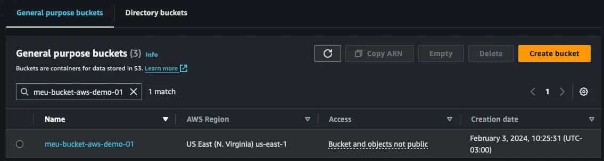

One of the challenges that technology teams face when managing cloud resources is dealing with infrastructure that was not initially created using Infrastructure as Code (IaC) tools like Terraform. Without IaC, teams miss out on various benefits, such as reusability across projects, and may experience difficulties when transitioning to this methodology, which integrates infrastructure as code with application repositories and CI/CD pipelines.

A common problem arises when a team already has infrastructure running in production: how can these resources be integrated into the lifecycle of an infrastructure-as-code pipeline managed by the `.tfstate` file while avoiding potential issues? For instance, suppose there is an S3 bucket in a production environment on AWS. One migration strategy could be creating a new bucket and transitioning the application to it. However, this approach could lead to headaches and unnecessary costs. So how can we tell Terraform that these resources already exist while minimizing downtime and redundant work?

### Illustrating the Problem
Let’s consider creating an S3 bucket using Terraform:

<script src="https://gist.github.com/davidalecrim1/8c4195b4443e64dd7891d074fdd26b19.js"></script>

However, the issue arises when the application using this infrastructure is already in production. What can we do in such cases? As shown below, the bucket already exists in the AWS account.



Now, let’s run `terraform plan` and observe the outcome.

<script src="https://gist.github.com/davidalecrim1/32ae64e95396707a93e2ecd4eefe1baf.js"></script>

Even though the bucket name matches exactly with the one created in the AWS account, Terraform still assumes that the resource does not exist in its lifecycle. Running `terraform apply` would result in an error from the AWS API.

### Is There an Alternative?
To address this issue, Terraform introduced the `import` feature in version 1.5. With a simple block, we can inform Terraform’s lifecycle that a resource already exists and should only be modified if explicitly declared in the code. Here’s how it looks in practice:

<script src="https://gist.github.com/davidalecrim1/a84a17425702fca7c7ea98fda158d0c4.js"></script>

The `id` represents the unique identifier of the AWS resource, which, in this case, is the bucket name. The `to` field links the declared Terraform resource to the existing one. Now, simply re-running `terraform plan` will confirm whether Terraform recognizes our bucket’s existence.

At this point, Terraform correctly understands that our bucket exists in AWS and imports it into the `meu_bucket` block. This enables modifications (such as adding project-specific tags) while maintaining the infrastructure pipeline with Terraform.

### Can It Get Even Better?
While the `import` feature makes resource management easier, wouldn’t it be even more convenient if we could automatically generate the entire resource declaration? In our example, even though Terraform acknowledges the resource’s existence, it does not automatically generate the corresponding code in `main.tf`.

To address this, Terraform introduced the ability to generate configuration files during the `terraform plan` stage. This allows us to generate a resource declaration and optionally combine it with the `import` feature we used earlier. Here’s how:

<script src="https://gist.github.com/davidalecrim1/02b5e3d28c222fb5b76e04d1e573b4d9.js"></script>

Now, let’s import an IAM Role that was originally created via the AWS console and generate its Terraform declaration using the following command:

```bash
terraform plan -generate-config-out='generated.tf'
```

This command creates a file named `generated.tf`. Let’s examine it:

<script src="https://gist.github.com/davidalecrim1/fea9cb3d7abc4290bad6fd1bb041f6c2.js"></script>

### Conclusion
By leveraging both the `import` and `generate-config-out` features, we can inform Terraform’s lifecycle that an existing resource should be managed without re-creating it. Additionally, we can generate its Terraform declaration automatically, simplifying the migration from manually created infrastructure to Infrastructure as Code.

This approach helps teams transition smoothly while minimizing downtime and potential risks, ensuring a seamless integration of existing cloud resources into Terraform’s lifecycle.