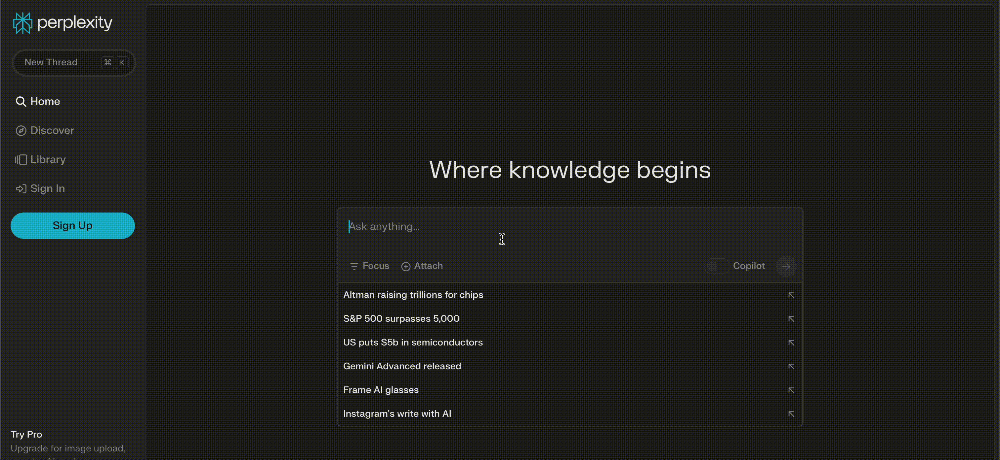

Você já parou para refletir sobre como a internet mudou drasticamente nossas vidas? Quando o Google surgiu e revolucionou completamente a maneira como buscamos informações online. Era como se um mundo de conhecimento estivesse literalmente ao alcance dos nossos dedos, e tudo isso graças aos complexos algoritmos por trás daquela simples caixa de pesquisa.

### IA? AI?

Mas e agora, com o avanço da Inteligência Artificial (IA)? Assim como o Google abalou os primórdios da internet com sua ferramenta de busca, o mesmo fez a OpenAI quando lançou o ChatGPT, uma ferramenta que transforma a forma como interagimos com a internet, com isso, ao invés de passar horas navegando por páginas e páginas em busca de respostas, agora podemos simplesmente fazer uma pergunta e receber uma resposta direta. É como ter um assistente pessoal sempre disponível, embora claro, ainda há limitações.

E não é apenas o ChatGPT que está mudando a forma como interagimos com a internet, o TikTok, por exemplo, criou nova maneira para as gerações mais jovens acessarem informações, substituindo a tradicional busca na web por uma experiência mais imersiva e visual com seus vídeos, misturando a primordial busca na internet com vídeos curtos cheios de informações.

Mas e o futuro? Bem, parece que a Microsoft está pronta para dar mais um passo à frente. Ao reconhecer o potencial dos modelos de IA desenvolvidos pela OpenAI, a empresa apresentou no Bing, seu motor de busca rival ao Google, um novo conceito de busca online. Com essa experiencia já disponível, e utilizando um conceito chamado de RAG (i.e. Retrieval Augmented Generation), o mecanismo de busca que não apenas fornece links e textos com base em palavras chave, mas uma experiência inovadora gerando um prompt otimizado para o modelo de IA com base os principais resultados da busca tradicional. Como disse uma vez Jeff Bezos, os clientes/usuários nunca estarão satisfeitos, eles estarão sempre buscando por algo melhor, uma experiencia melhor, mesmo que nem eles saibam exatamente o que é. Essa busca incessante por melhorias, junto com claro, a concorrência de empresas, que impulsiona a inovação da tecnologia no mundo.

E falando de Jeff Bezos, o fundador da Amazon fez um investimento em uma empresa que está sendo conhecida por ser rival a busca tradicional oferecida pela Google, e a busca baseada por IA pela Microsoft, a empresa Perplexity AI. Trazendo uma experiencia similar ao que a Microsoft tem feito com o Bing AI, utilizando o conceito de RAG para realizar o prompt no modelo, para oferecer uma experiencia de respostas geradas por IA Generativa com base os principais e mais relevantes resultados da busca.

### Isso nos leva a pensar…

À medida que nos aproximamos desse novo capítulo da busca na internet, com a IA moldando o caminho, assim como muitas outras ferramentas que estão aparecendo pelo boom de IA, só podemos esperar que essa revolução nos traga uma experiência ainda mais intuitiva, personalizada e eficiente. Assim como antes do Google poderíamos gastar centenas de horas para encontrar uma informação, e com a ferramenta ver isso ser reduzido para minutos, o futuro com ferramentas como a Perplexity AI nos promete talvez segundos, com uma experiencia cada vez mais inovadora. E claro, o Google com certeza não deixará a concorrência na frente, com isso o futuro parece estar chegando, e nós seremos os mais beneficiados com a concorrência das big techs. E ai, você está preparado?
