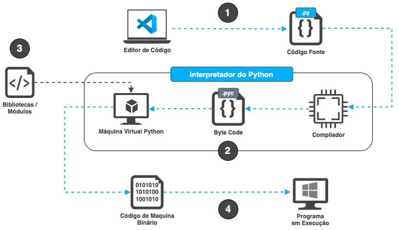

Behind every line of code in a simple program written in any programming language lies a vast and complex world, meticulously designed to create and manipulate digital systems. In this realm of software engineering, there is no absolute right or wrong—only trade-offs in every decision. Whether it's an interpreted or compiled language, or a hybrid approach combining both, each has its own advantages and challenges.  

In this article, we will explore interpreted programming languages in more depth, unveiling their internal architecture and understanding how they differ from compiled languages. We'll use Python as an example, but the concepts apply to other interpreted languages as well.  

---

## **Compiled vs. Interpreted Languages**  

An interpreted programming language executes source code line by line in real-time, translating and executing each instruction as it is encountered. This allows for rapid prototyping and easier debugging but can result in generally slower performance.  

On the other hand, a compiled language—such as Go—translates the entire source code into machine code before execution, producing a standalone executable program specific to the target hardware and operating system. For example, a binary compiled for Windows will not run on macOS, and a macOS binary compiled for Intel x86–64 processors will not work on newer macOS machines using Apple’s ARM64 processors.  

Interpreted languages, however, abstract away this complexity through an interpreter, which ensures compatibility with different hardware and operating systems. This provides an advantage in terms of cross-platform portability for written code.  

---

## **Dynamically Typed vs. Statically Typed Languages**  

Another key distinction in programming languages is whether they are dynamically or statically typed.  

- **Dynamically typed languages**, such as Python, associate variable types with values at runtime. This means that you don’t need to explicitly declare a variable’s type when assigning a value. For instance, in Python, you can simply write `value = 10` without specifying the type, and the Python interpreter will infer that `value` is an integer (`int`).  

- **Statically typed languages**, such as Go or C++, require explicit type declarations before usage, like `var value int = 10`. This is typically enforced during the compilation process.  

Dynamically typed languages offer more flexibility and ease of use but can introduce subtle bugs that only manifest during execution. Conversely, statically typed languages provide better performance and type safety since errors are caught at compile time rather than runtime. Again, there is no absolute right or wrong—only trade-offs based on the project's specific needs.  

---

## **Internal Architecture of an Interpreted Language**  

For educational purposes, let’s use Python as an example, keeping in mind that implementation details vary between languages. Consider the following execution process:  

1. **Writing the Code**: The process begins with the developer writing the code in a text editor, such as **VS Code**, and saving it as a `.py` file.  

2. **Python Interpreter**: The code is sent to the interpreter, which is responsible for executing the program. The interpreter consists of two main components:  
   - **The Compiler**, which converts Python code into bytecode (`.pyc`).  
   - **The Python Virtual Machine (PVM)**, which executes this bytecode, processing each instruction one by one.  

3. **Libraries/Modules**: If the code imports external Python libraries (e.g., `import requests`), these are also compiled into bytecode and executed by the PVM.  

4. **From Bytecode to Machine Code**: The bytecode is then converted into machine code, which is directly understood by the computer’s processor (CPU), such as an ARM64 chip in macOS. Once translated, the computer executes the program.  

This process repeats every time the program is run. The steps can be visualized in the diagram below:  

  

It's important to note that this is a simplified explanation for educational purposes. Many complexities are abstracted away, and each programming language and operating system has its own specific implementation details.  

---

## **Conclusion**  

Behind every line of code lies a world of trade-offs and carefully considered decisions, enabling developers to create efficient and robust solutions for a variety of problems.  

The distinction between compiled and interpreted languages, as well as dynamically and statically typed languages, highlights the diverse approaches available to developers and the trade-offs inherent in each choice. There is no single "right" solution—only a range of options that must be carefully evaluated based on the project’s specific requirements.  

Ultimately, I hope this exploration of how interpreted programming languages work provides you with a more holistic understanding of the fascinating and intricate world of software engineering.