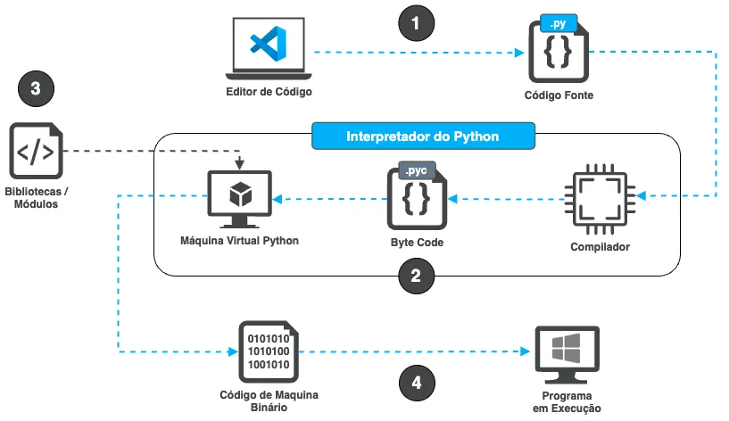

Por trás de cada linha de código em um simples programa feito em alguma linguagem de programação há vasto mundo complexo que foi pensado em detalhe em como podemos criar coisas no mundo da computação, e nesse mundo de engenharia de software não há um certo ou errado, apenas trocas (i.e. trade-offs) de cada escolha. Seja uma linguagem de programação interpretada, compilada ou entre outras que podem combinar ambas abordagens.
Aqui vamos explorar um pouco mais sobre linguagem de programação interpretada, desvendando sua arquitetura interna e entendendo como ela difere das linguagens compiladas. Vamos utilizar Python como um exemplo, mas os conceitos são similares para outras linguagens interpretadas.

### Compilado vs Interpretado
Uma linguagem de programação interpretada executa o código fonte linha por linha em tempo real, traduzindo e executando cada instrução conforme encontrada. Isso permite rápida prototipagem e facilita a depuração, mas pode resultar em um desempenho geralmente mais lento. Por outro lado, uma linguagem compilada, como por exemplo Go, traduz todo o código fonte em código de máquina antes da execução, produzindo um programa executável independente, especifico para aquela arquitetura de hardware e o sistema operacional em que será executado, então, por exemplo, um binário para Windows não irá rodar em um MacOS, e um binário para MacOS compilado para processador x86–64 da Intel, não funcionará para os MacOS maios novos com processador ARM64 da Apple. Já as linguagens interpretadas abstraem a complexidade com um interpretador, e esse será responsável por ser compatível com determinado hardware e sistema operacional, trazendo uma vantagem em portabilidade entre plataformas do código escrito.

### Linguagem Dinamicamente Tipada vs Estaticamente Tipada
Outra distinção importante entre linguagens de programação é se elas são dinamicamente ou estaticamente tipadas. Em linguagens dinamicamente tipadas, como Python, os tipos das variáveis são associados aos valores em tempo de execução. Isso significa que você não precisa declarar explicitamente o tipo de uma variável ao criar ou atribuir um valor a ela. Por exemplo, em Python, você pode simplesmente escrever valor = 10 sem especificar o tipo de valor, e o interpretador Python entenderá que valor é um inteiro(int). Por outro lado, em linguagens estaticamente tipadas, como Go ou C++, você precisa declarar o tipo de uma variável explicitamente antes de usar, como var valor int = 10. Isso geralmente é feito durante a compilação do código. Embora as linguagens dinamicamente tipadas ofereçam mais flexibilidade e facilidade de uso em alguns casos, elas tendem a introduzir bugs sutis no código que só serão percebidos durante a execução do programa. As linguagens estaticamente tipadas podem oferecer melhor desempenho e segurança, já que os erros de tipo são detectados em tempo de compilação em vez de em tempo de execução. Cada abordagem tem seus próprios prós e contras, lembre-se, não há certo ou errado, somente há trade-offs em engenharia de software. A escolha entre elas geralmente depende das necessidades específicas do projeto.

### Arquitetura Interna de Uma Linguagem Interpretada
Para fins didáticos, vamos utilizar o Python como exemplo, dado que a estrutura pode variar levemente entre linguagens. Considere o código a seguir:

Quando esse executado em um computador, o processo ocorre da seguinte forma:
1. **Escrevendo o Código**: O processo começa com a pessoa desenvolvedora escrevendo o código em um editor de texto, como por exemplo **VS Code**, e salvando-o como um arquivo com extensão .py.
1. **Interpretador do Python**: O código é enviado para o interpretador, que é responsável por executar o programa, ele consiste em duas partes: **o compilador** e **Máquina Virtual Python (PVM)**. O compilador, que converte o código Python em byte code, conhecido pela extensão `.pyc` e a PVM executa esse byte code, seguindo as instruções uma por uma.
1. **Bibliotecas / Módulos**: Se o código utilizar módulos de biblioteca do Python, como por exemplo `import requests`, esses também serão convertidos em byte code e executados pelo PVM.
1. **Do Byte Code para o Código de Máquina**: O byte code é então convertido em código de máquina, que é entendido diretamente para o especifico processador (CPU) do computador, como por exemplo um ARM64 do MacOS. Após a conversão para código de máquina, o computador usa esse código para executar o programa.

Este processo é repetido cada vez que o programa é executado. Ele pode ser resumido na imagem abaixo:

É importante mencionar que estamos utilizando apenas um exemplo para fins didáticos, há vários pontos de complexidade que são abstraídos nesse processo, lembre-se que cada linguagem de programação tem seu “mundo”, assim como cada sistema operacional e por ai vai.

### Conclusão
Por trás de cada linha de código, há um vasto mundo de decisões e compromissos que foram cuidadosamente considerados para permitir que os programadores desenvolvam soluções eficientes e robustas para uma ampla variedade de problemas.

A distinção entre linguagens compiladas e interpretadas, bem como entre linguagens dinamicamente e estaticamente tipadas, ressalta a diversidade de abordagens disponíveis para os desenvolvedores e as trocas inerentes a cada escolha. Não há uma solução única ou correta, mas sim uma série de trade-offs que devem ser ponderados de acordo com as necessidades específicas de cada projeto. Lembre-se de escolher bem conforme cada necessidade.

Por fim, espero que esse entendimento de como as linguagens de programação interpretadas funcionam possa ajudar em sua visão mais holística desse mundo complexo e maravilhoso de engenharia de software.

Até a próxima. Se chegou até aqui, deixe sua curtida.